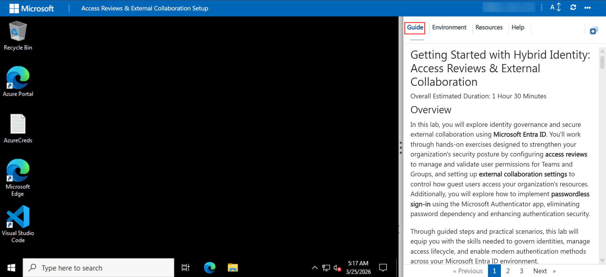

# Getting Started with Hybrid Identity: Access Reviews & External Collaboration
 
#### Overall Estimated Duration: 1 Hour 30 Minutes
 
## Overview
 
In this lab, you will explore identity governance and secure external collaboration using **Microsoft Entra ID**. You'll work through hands-on exercises designed to strengthen your organization's security posture by configuring **access reviews** to manage and validate user permissions for Teams and Groups, and setting up **external collaboration settings** to control how guest users access your organization's resources. Additionally, you will explore how to implement **passwordless sign-in** using the Microsoft Authenticator app, eliminating password dependency and enhancing authentication security.
 
Through guided steps and practical scenarios, this lab will equip you with the skills needed to govern identities, manage access lifecycle, and enable modern authentication methods across your Microsoft Entra ID environment.
 
## Objectives
 
By completing this lab, you will have practical knowledge of configuring identity governance and secure collaboration controls within **Microsoft Entra ID**:
 
- Create a **Microsoft 365 group** and assign owners and members to establish an access review scope.
- Configure **recurring access reviews** for Teams and Groups with automated reviewer assignment, monthly recurrence, and auto-apply settings.
- Review and manage **user access** using the **My Access portal**, accepting system recommendations or making manual approve/deny decisions.
- Enable **guest self-service sign-up** via user flows to allow external users to onboard independently.
- Configure **external collaboration settings** including guest user access levels, guest invitation permissions, email one-time passcode authentication, and collaboration restrictions.
- Enable **passwordless phone sign-in** using the **Microsoft Authenticator app** and validate the end-to-end passwordless authentication experience.
 
## Architecture
 
The architecture for this lab is centered around **Microsoft Entra ID's identity governance and external identity capabilities**, working together to enforce least-privilege access and secure collaboration.
 
**Access Reviews** operate within **Microsoft Entra Identity Governance**, enabling administrators to create scheduled review cycles for group memberships. The review workflow assigns designated reviewers — in this case the **ODL_User** — who evaluate user access through the **My Access portal**. Auto-apply settings ensure that review decisions are automatically enforced on the underlying resource (the **All Users** group), and recommendations based on sign-in activity help reviewers make informed decisions without manual investigation.
 
**External Collaboration Settings** are managed through **Microsoft Entra External Identities**, which controls how guest users interact with the directory. **Email one-time passcode** authentication provides a secure, passwordless onboarding path for guests who do not have existing Microsoft accounts. **Guest user access restrictions** limit external users to their own directory objects, reducing exposure to internal directory data. **Guest invitation controls** define which internal users can invite external collaborators, ensuring governed and auditable onboarding.
 
**Passwordless Authentication** is implemented through the **Microsoft Authenticator app** integrated with **Entra ID authentication methods policies**. The phone sign-in flow replaces password prompts with app-based approval, leveraging **multi-factor authentication** principles without requiring a password. The sign-in method is registered per user, and validation is performed end-to-end through the Azure portal sign-in experience.
 
Together, these capabilities form a layered identity governance model — controlling who has access (access reviews), how external users collaborate (external collaboration settings), and how all users authenticate (passwordless sign-in) — aligned to a **Zero Trust** security posture.

## Explanation of Components

- **Microsoft Entra ID:** Microsoft Entra ID is a cloud-based identity and access management service that provides single sign-on (SSO), multi-factor authentication (MFA), and conditional access capabilities. It serves as the central identity provider for cloud and hybrid environments, enabling organizations to authenticate users, manage application access, and enforce security policies across the organization.

- **Active Directory Domain Services (AD DS):** Active Directory Domain Services is the on-premises identity management system that manages users, computers, and resources within a corporate network. It provides authentication, authorization, and directory services, forming the foundation of on-premises identity infrastructure and requiring synchronization with cloud services through tools like Microsoft Entra Connect.

- **Microsoft Entra Connect:** Microsoft Entra Connect is a synchronization tool that bridges on-premises Active Directory with Microsoft Entra ID, enabling bidirectional identity synchronization. It ensures that user accounts, groups, and contacts are consistently maintained across both environments, while supporting password writeback for on-premises password changes initiated from the cloud.

- **Azure Monitor:** Azure Monitor is a comprehensive monitoring service that collects, analyzes, and visualizes telemetry data from Azure resources, applications, and on-premises systems. It enables proactive performance tracking, anomaly detection, and issue identification through metrics, logs, and traces, providing insights into system health, availability, and performance trends.

- **Azure Log Analytics:** Azure Log Analytics is a powerful tool within Azure Monitor that collects and queries logs from various Azure services, on-premises resources, and third-party sources. It provides deep insights into application health, performance, security events, and user behavior through Kusto Query Language (KQL), enabling investigation, alerting, and compliance reporting for security and operational purposes.

## Accessing Your Lab Environment

Once you're ready to dive in, your virtual machine and lab guide will be right at your fingertips within your web browser.

### Virtual Machine & Lab Guide
 
Your virtual machine is your workhorse throughout the workshop. The lab guide is your roadmap to success.

## Exploring Your Lab Resources
 
To get a better understanding of your lab resources and credentials, navigate to the **Environment** tab.

## Utilizing the Split Window Feature
 
For convenience, you can open the lab guide in a separate window by selecting the **Split Window** button from the Top right corner.

 
## Managing Your Virtual Machine
 
Feel free to start, stop, or restart your virtual machine as needed from the **Resources** tab. Your experience is in your hands!

## Let's Get Started with Azure Portal

1. On your Lab virtual machine, click on the **Azure Portal** icon to sign in to the Azure.

        

1. On the Sign in blade, you will see a login screen, in which enter the following email/username and password and then click on Sign in.

    * Azure Username/Email:  <inject key="AzureAdUserEmail"></inject>

        

    * **Temperory Access Pass**:  <inject key="AzureAdUserPassword"></inject>

        **Note**: Refer to the **Environment** tab for any other lab credentials/details.

        
  
1. If you see the pop-up **Stay Signed in?** click **Yes**.

    

1. If you see the pop-up **You have free Azure Advisor recommendations!** close the window to continue the lab. 

1. If a **Welcome to Microsoft Azure** popup window appears, click **Maybe Later** to skip the tour.

    

## Support Contact

The CloudLabs support team is available 24/7, 365 days a year, via email and live chat to ensure seamless assistance at any time. We offer dedicated support channels tailored specifically for both learners and instructors, ensuring that all your needs are promptly and efficiently addressed.

Learner Support Contacts:

- Email Support: cloudlabs-support@spektrasystems.com
- Live Chat Support: https://cloudlabs.ai/labs-support

Click **Next** from the bottom right corner to embark on your Lab journey!

### Happy Learning!!
